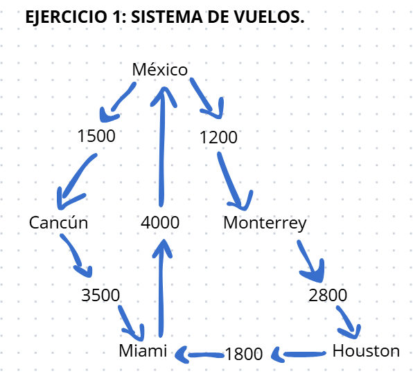
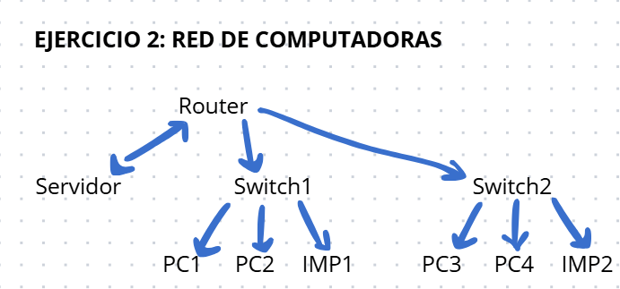
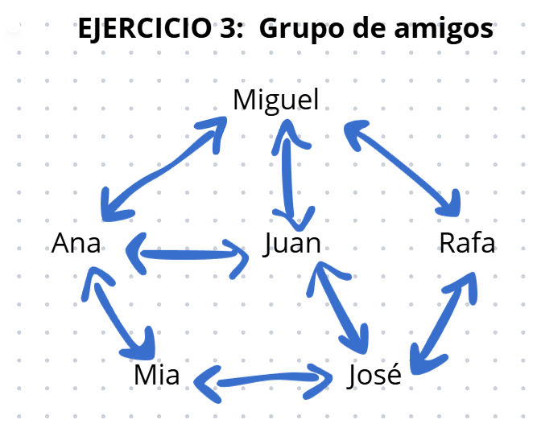

# Tarea 1.2: Modelado de Grafos

## Información
- **Nombre:** [Miguel Angel Echartea Rodriguez]
- **Fecha:** [05/12/2025]

## Ejercicio 1: Sistema de Vuelos
[Este es un claro ejemplo de un grafo mezclado es dirigido y tiene ciclos. Donde los vertices son los paises y las aristas a donde se sirige el vuelo.]

## Ejercicio 2: Red de Computadoras
[Este ejercicio contiene un arbol, ya que no tiene ciclos, dirigo y un componente crítico porwue si se desconecta el Router, todo lo demas no tendra la cohesion para el funcionamiento. Donde los vertices son los componentes y las aristas a que van conectados.]

## Ejercicio 3: [Grupo de amigos]
[Es la conexion-comunicacion mas frecuente entre mis amigos y yo. No es dirigido y es bidireccional donde los vertices somos las personas y las aristas son las conexiones.]

